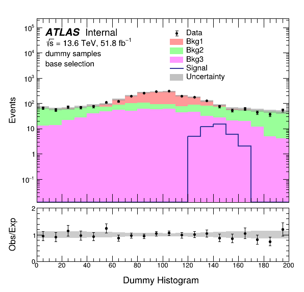

Matplotlib style ROOT-backend plotting package

- YAML config based plotting
- python3 makeplot.py --config configs/test_config.yaml
- For more options check `makeplot.py` macro

Unit-test:

- jupyter notebook: `unittest_pyplotlib.ipynb` (look at the demo! It is fun!)
- TODO: Github actions workflow or CI/CD pipeline

What you can do with it:

- publication level plot (CMS/ATLAS)
- overlay of any samples
- usual background stack, signal overlaid, data overlaid style plotting
- Flexible binning
- Signal significance study (S/rootB in ratio plot added now in `makeplot.py` macro!)

Wishlist:

- TGraph (limit plots!)
- anything else
- Improving coding style/pip installation may be

Example plot:

